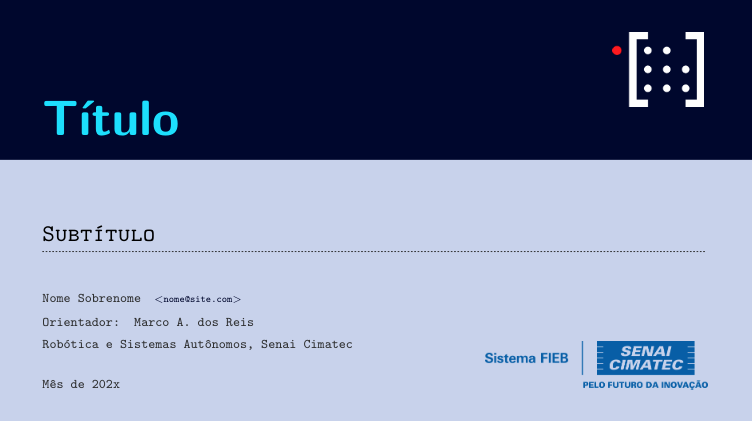
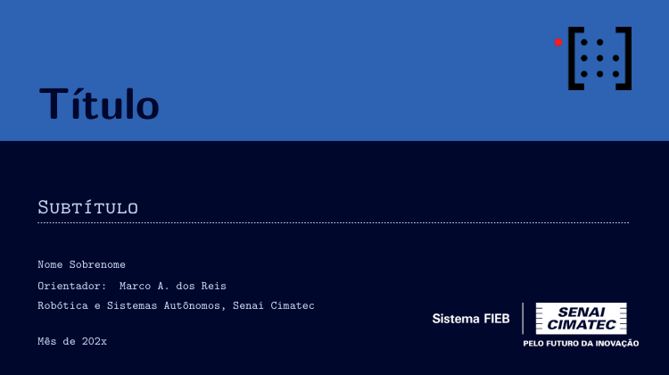

### SIMPLE Beamer
A simple presentation template.

# Main Style
<p align="center">
  
</p>

# Style A
<p align="center">
  
</p>

# Style B
<p align="center">
  
</p>

## How To Use

To clone and run this beamer, follow command line above:

```bash
# Clone this repository
$ git clone https://github.com/mhar-vell/beamer-template

# Go into the repository
$ cd beamer-template

# Open on VS Code
$ code .

```

## Important
Better to view on **[Okular]**


[Okular]: https://okular.kde.org


